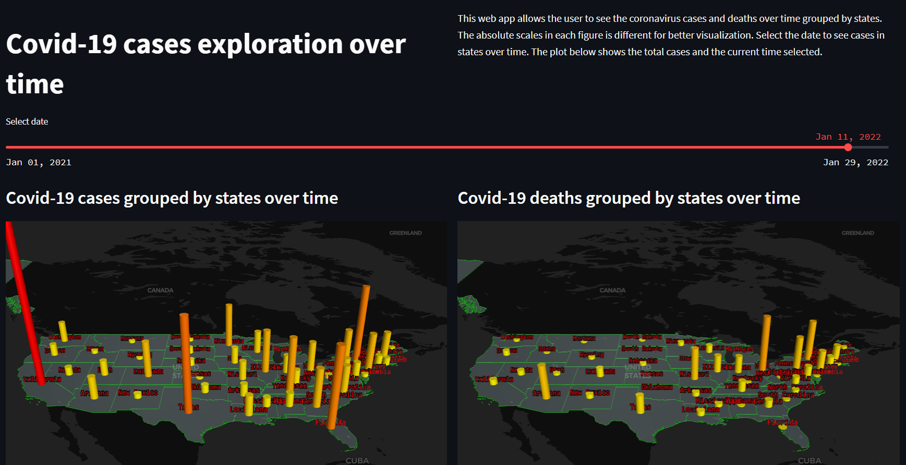
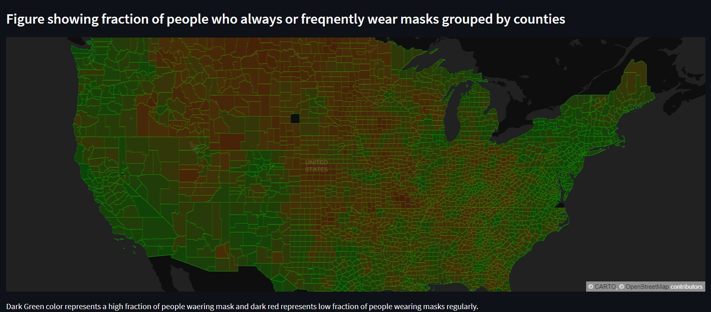

# US_Covid-19_Visualization
Data visualization of Covid-19 data over time on 3D topographic maps.
 
You can scroll through time to see the cases and deaths in each of the US states on a 3d map.  
You can also see the mask usage in each county and the fraction of people who regularly wear mask.  
 
You can interact with this app here:  
 
 

 
<b>Covid cases and deaths shows in each state over time.<b>
 
 

 
<b>Fraction of people who regularly wear mask in each US county<b>
